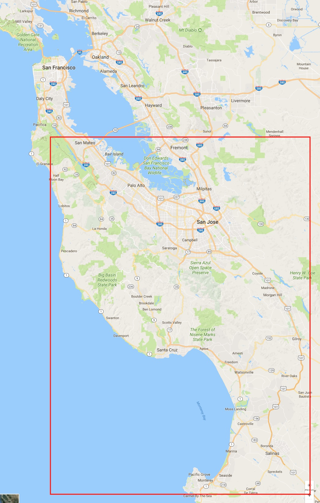

---
# blog page must be named index.html and in its own folder to support pagination
# https://jekyllrb.com/docs/pagination/
layout: page
title: Resume of Jason Laumeister
---
## Choose a resume file format below.
#### Note that you can right-click a link and select "Save Link As" to download a copy.

* [HTML](resume-jason-laumeister.html)
* [PDF](resume-jason-laumeister.pdf)
* [Microsoft Word](resume-jason-laumeister.docx)
* [JSON](resume-jason-laumeister.json)

Read more about JSON resume schema format at [jsonresume.org](https://jsonresume.org/schema/).

## How far can I commute?

I live in Santa Cruz County California, about one and a half hours south of San Francisco by car.

Below is a map of where I can comfortably commute on a daily basis. If the job location is outside of the red box, the work has to be very compelling for me to consider a regular commute. For awesome projects I've commuted as far north as San Francisco a few times a week. 

#### Note that you can right-click the map and select "Save Image As" to download a copy.

